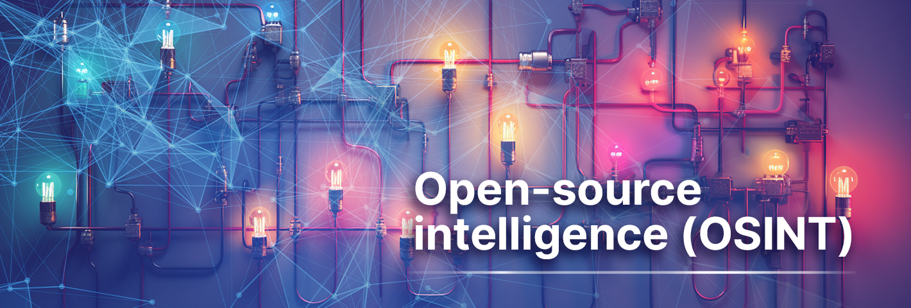

# OSINT CTF

## Introduction
Welcome to the **0xL4ugh's xElessaway OSINT CTF**! This repository contains a series of challenges designed to sharpen your Open Source Intelligence (OSINT) skills. Each challenge varies in difficulty and will test your ability to gather, analyze, and interpret publicly available information.

## Challenges

### 
- **[Jabalya](Easy/Jabalya)**
- **[Jenin](Easy/Jenin)**
- **[Khan Yunis](Easy/Khan_Yunis)**
- **[Nablus](Easy/Nablus)**

### 
- **[Deir al-Balah](Medium/Deir_al-Balah)**
- **[Gaza](Medium/Gaza)**
- **[Ramallah](Medium/Ramallah)**

### 
- **[Jerusalem](Hard/Jerusalem)**
- **[Rafah](Hard/Rafah)**
---
## Answers
## 
**PLEASE TRY HARD AS MUCH AS YOU CAN BEFORE GOING TO ANSWERS AND ALWAYS DO ONE THING "جرب" (TRY)**

The **Answers** directory contains solutions [PASSWORDS ONLY].
- **[Answers Directory](Answers/)**

---
# Social Media

For any inquiries or if you encounter any problems, don’t hesitate to contact me!

[-1DA1F2?style=flat&logo=twitter&logoColor=white)](https://x.com/ahmed_elessaway)

